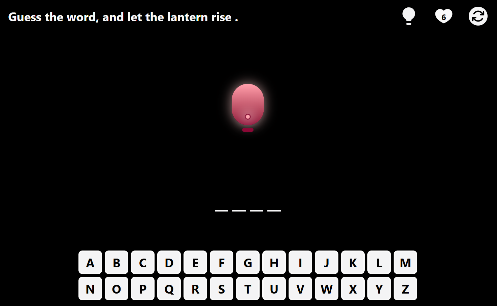
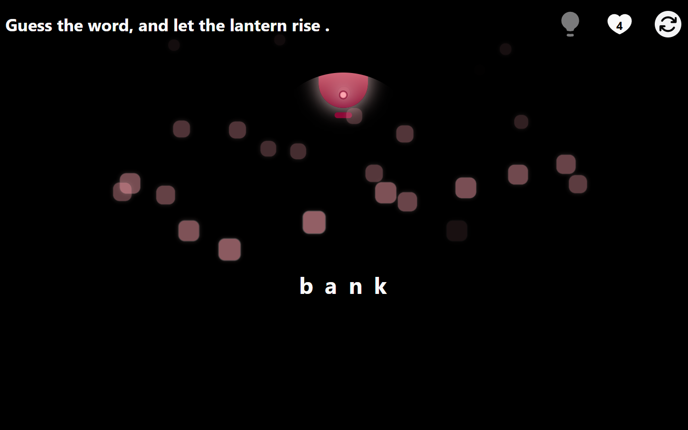
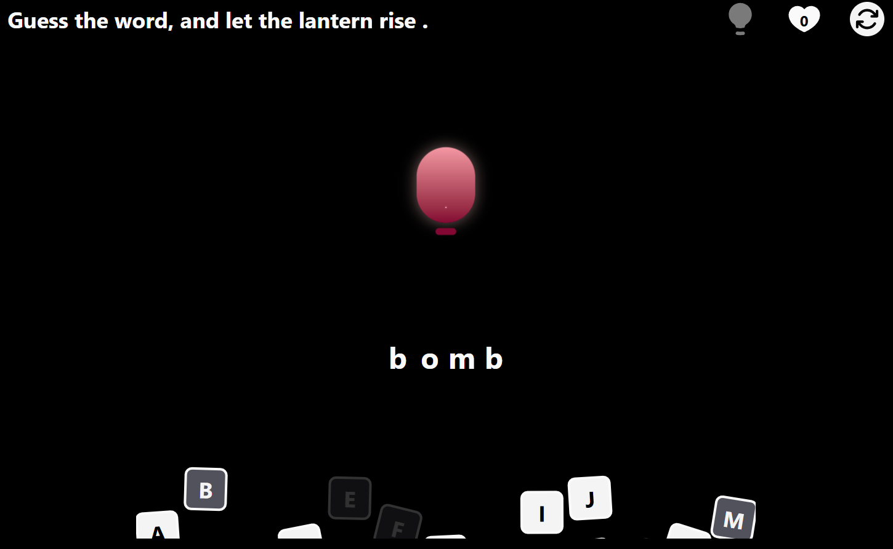

# Lantern — a tiny word game with big vibes

Guess the 4-letter word. Win and the lantern glows and floats; lose and the keys tumble while the lantern dims. Smooth, purposeful motion—no jank.

## Demo

* **Live:** [https://lantern-omega.vercel.app/]
* **Screens:**

  * 
  * 
  * 

> Put your images in a root-level `docs/` folder so GitHub can render them.

## Features

* 🔤 4-letter word guessing with single-use hint
* ❤️ Heart / lives system
* 🏮 Lantern as hero animation (float/glow on win, dim on loss)
* ⌨️ Animated keyboard (morph → rise on win; tilt → drop on loss)
* 🧊 Smooth, jank-free motion (fixed containers + transforms)
* 🧱 Clean React + TypeScript + Tailwind + Framer Motion

## Stack

React • TypeScript • Framer Motion • Tailwind CSS • Heroicons

## Getting Started

```bash
# install
npm install

# dev server
npm run dev

# production build
npm run build

# preview production build locally
npm run preview
```

## Project Structure

```
src/
  components/
    Header.tsx
    Keyboard.tsx
    Lantern.tsx
    Word.tsx
  hooks/
    UseLogic.ts
  data/
    keyLetters.json
    wordList.json
  App.tsx
  App.css
```

## State & Game Logic

All game state lives in a single custom hook: `UseLogic()` (no Redux/Zustand needed for this scope).

**Public API**

```ts
// hooks/UseLogic.ts
type GameStatus = 'onGoing' | 'lost' | 'won';

export interface GameState {
  rndWord: string;              // current answer
  userLetter: string[];         // unique, normalized guesses
  heart: number;                // lives remaining
  gameStatus: GameStatus;       // finite state
  hintLtr: string | null;       // one-shot hint

  handleUserWord(ltr: string): void; // guess flow
  handleHint(): void;                // reveal a letter, disable button
  reset(): void;                     // new round
}
```

**State machine**

* `onGoing → won` when all letters are revealed
* `onGoing → lost` when hearts reach 0
* `reset() → onGoing` (new `rndWord`, clears round state)

**Rules**

* Hearts decrement only on **new** incorrect guesses (repeats don’t punish)
* Hint is single-use per round
* Visuals (Lantern / Keyboard / Word) are pure functions of `gameStatus`

**Why no global store?**

* Single-screen app: a custom hook keeps it **simple, local, and testable**
* Easy to swap to Zustand/Redux later for **persistence** (streaks/leaderboards)

**Extensibility**

* Add streak/history via `localStorage` or a small Zustand store
* Parameterize word length/difficulty via `UseLogic` options

## Notes / Implementation Highlights

* **Variant-driven animations:** Lantern & Keyboard use Framer Motion variants for readable, maintainable motion.
* **No layout shifts:** reserved containers + `transform` (x/y/rotate/scale) instead of width/height where it matters.
* **Stable randomness:** per-key randomness memoized so re-renders don’t reshuffle flight paths.

## License

MIT © Zahra Soleymani

